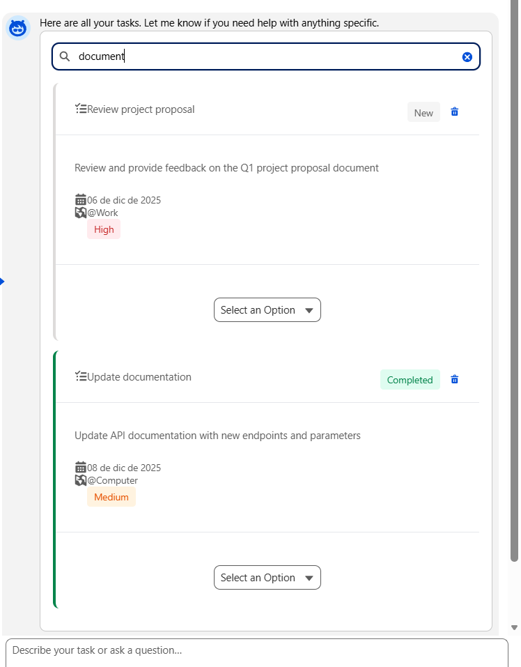

# AssistantApp — Agentforce Task Assistant

AssistantApp is a lightweight Salesforce DX sample that demonstrates an Agentforce-driven task assistant. It includes Apex actions that the agent calls, Lightning Custom Types (CLTs) to render agent UI, and a small set of Lightning Web Components used to present tasks and task lists inside the chat UI.

Key goals:
- Provide consistent, CLT-safe payloads from Apex invocable actions
- Render tasks using reusable LWC cards and a list component
- Follow SLDS patterns for theming and accessibility

---

## Repo Structure (important files)

- `force-app/main/default/classes/`
	- `PAB_AgentFindTask.cls` — Invocable action returning `PAB_TaskResponse` (list of tasks). Used by the agent to find tasks.
	- `PAB_AgentCreateTask.cls` — Invocable action to create task(s). Returns same response wrapper as find for consistent rendering.
- `force-app/main/default/lwc/`
	- `ihdTaskCard/` — Reusable task card LWC (display + status change + delete request events). Uses SLDS and dynamic border color.
	- `pabAgentTaskList/` — List component that normalizes agent payloads and renders multiple `c-ihd-task-card` entries.
- `force-app/main/default/lightningTypes/`
	- `PAB_Task_List/` — CLT that maps the Find Task action output to `c/pabAgentTaskList` renderer.
	- `PAB_Task_Card_Created/` — CLT for Create Task responses (mirrors `PAB_Task_List` behavior).

---

## What we accomplished

This project contains a complete, end-to-end example showing how an Assistant (Agentforce) can:

- Provide structured task data from Apex invocable actions (`PAB_AgentFindTask`, `PAB_AgentCreateTask`).
- Return a CLT-safe response wrapper (`PAB_TaskResponse.aUserTasks.userTasks[]`) so the UI rendering is predictable.
- Render task cards using a reusable LWC (`ihdTaskCard`) that follows SLDS patterns and exposes events for status changes and deletes.
- Render a stacked, responsive list using `pabAgentTaskList` that normalizes several payload shapes (flat arrays, wrapped lists, agent response envelopes).
- Add dynamic, theme-aware visual indicators (status border color, badges) while keeping custom CSS minimal and SLDS-first.

This means the agent can call either the Find or Create action and the same CLT/LWC system will display results consistently.

---

## Screenshots / Visuals

Paste images here to show the UI and behavior. Example Markdown image placeholders are provided so you can drop in screenshots from your work:

- Task list (stacked cards):

- Filtering funct (Description, status, date):

---

## How the pieces fit

- Agent -> Invocable Apex action
	- `PAB_AgentFindTask.getUserTasks` returns structured data in `PAB_TaskResponse.aUserTasks.userTasks[]`.
	- `PAB_AgentCreateTask.execute` returns `PAB_TaskResponse` (created task wrapped the same way).

- CLT mapping
	- Each Lightning Type `schema.json` references an Apex response type using the `@apexClassType/...` pattern. The CLTs in `lightningTypes/` map those responses to renderer components in `lightningDesktopGenAi/renderer.json`.

- LWC rendering
	- `pabAgentTaskList` normalizes incoming payloads (handles wrapped `aUserTasks`, `userTasks`, or flat arrays) and exposes `cardEntries` for the template.
	- `ihdTaskCard` accepts a normalized single-task payload and provides: title, description, due date, context, energy level, status combobox and delete request event. It uses SLDS utilities and minimal custom CSS.

---

## Notes about design decisions

- CLT response format parity: Find and Create actions return the same wrapper (`PAB_TaskResponse` → `aUserTasks.userTasks[]`) so the same CLT/LWC can render both find and create results.
- SLDS-first: Components use SLDS utilities (`slds-card`, `lightning-badge`, `slds-grid`) to keep CSS minimal and consistent with Salesforce theming.
- Non-destructive LWC behavior: `ihdTaskCard` emits events (`taskstatuschange`, `requestdelete`) and defers persistence to parent/agent.

---

## Tips when updating or extending

- When adding new fields to the task payload make sure to:
	1. update the Apex wrapper `TaskCardWrapper` in `PAB_AgentFindTask`/`PAB_AgentCreateTask` (add `@InvocableVariable`),
	2. keep the CLT schema type in sync if you change wrapper or class names,
	3. update `pabAgentTaskList.normalize()` to accept any new wrapper shapes.

---

## Testing & validation

- Use small Apex test classes that call the invocable methods (`PAB_AgentFindTask` / `PAB_AgentCreateTask`) and assert the returned wrapper shapes.
- Run `sfdx force:source:deploy` or `sfdx force:source:push` and then verify in the org using the Agentforce chat UI.

---

